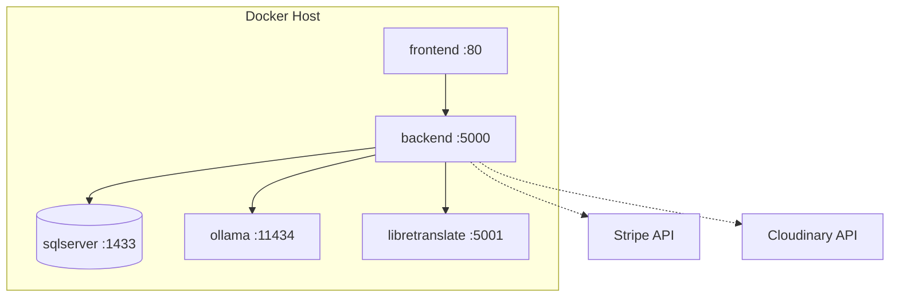
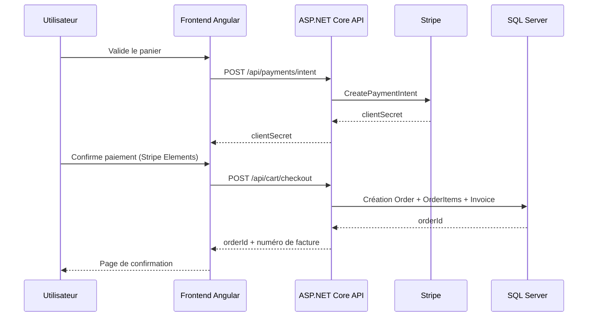

# DCT — Document de Conception Technique

---

**Équipe :** Tiago Da Costa · Arthur L'Afféter · Tom Leprieur  
**Classe :** CPI-3 26 DEV A — Bachelor 3 CPI Développement  
**Établissement :** SUP DE VINCI  
**Bloc certifiant :** BC3 — Superviser la mise en œuvre d'un projet informatique  
**Date :** Avril 2026

---

## Table des matières

1. [Objet du document](#1-objet-du-document)
2. [Périmètre technique](#2-périmètre-technique)
3. [Stack technique et justifications](#3-stack-technique-et-justifications)
4. [Architecture globale](#4-architecture-globale)
5. [Architecture backend](#5-architecture-backend)
6. [Architecture frontend](#6-architecture-frontend)
7. [Modèle de données](#7-modèle-de-données)
8. [Contrats API](#8-contrats-api)
9. [Sécurité technique](#9-sécurité-technique)
10. [Qualité logicielle](#10-qualité-logicielle)
11. [Déploiement et exploitation](#11-déploiement-et-exploitation)
12. [Évolutivité et roadmap](#12-évolutivité-et-roadmap)
13. [Décisions techniques notables](#13-décisions-techniques-notables)
14. [Limites et écarts à traiter](#14-limites-et-écarts-à-traiter)

---

## 1. Objet du document

Ce Document de Conception Technique (DCT) décrit l'architecture complète de la solution e-commerce **Althea Systems**. Il constitue la référence technique permettant à toute équipe IT de comprendre, maintenir, faire évoluer ou reproduire le système.

Il couvre :
- l'architecture globale et les choix technologiques justifiés
- l'architecture logicielle frontend et backend
- le modèle de données relationnel
- les contrats API exposés
- la stratégie de sécurité
- les procédures de déploiement
- la maintenance et l'évolutivité

---

## 2. Périmètre technique

### 2.1 Applications couvertes

| Application | Technologie | Port local |
|---|---|---|
| Front office web (SPA responsive) | Angular 21 | `:4200` |
| Backoffice administrateur (SPA) | Angular 21 | `:4200/admin` |
| API backend REST | ASP.NET Core (.NET 8) | `:5000` |
| Base de données relationnelle | SQL Server | `:1433` |
| Stockage images | Cloudinary (SaaS) | — |
| Paiement en ligne | Stripe (SaaS) | — |
| Chatbot IA local | Ollama + Mistral | `:11434` |
| Traduction dynamique | LibreTranslate | `:5001` |

### 2.2 Objectifs techniques

- Code modulaire et maintenable (Clean Architecture).
- Séparation claire des responsabilités entre couches.
- Sécurisation des accès (JWT, rôles, validation).
- Support de charge évolutif.
- Déploiement reproductible via conteneurs Docker.

---

## 3. Stack technique et justifications

### 3.1 Frontend — Angular 21

| Bibliothèque | Usage | Justification |
|---|---|---|
| **Angular 21** | Framework SPA | Typage fort (TypeScript), modularité, CLI puissant, écosystème mature |
| **RxJS** | Gestion des flux asynchrones | Natif Angular, observable pattern pour API calls et état |
| **Tailwind CSS** | Styles utilitaires | Développement rapide, responsive intégré, pas de CSS custom à maintenir |
| **ngx-translate** | Internationalisation (i18n) | Standard Angular i18n, support RTL, chargement lazy des fichiers de traduction |
| **Stripe.js** | Intégration paiement | Stripe Elements PCI-compliant, formulaire sécurisé côté client |
| **Chart.js** | Graphiques dashboard admin | Léger, bien intégré Angular, varié (histogramme, camembert) |

### 3.2 Backend — ASP.NET Core (.NET 8)

| Bibliothèque | Usage | Justification |
|---|---|---|
| **ASP.NET Core** | Framework Web API | Performance, écosystème Microsoft, Clean Architecture native |
| **Entity Framework Core** | ORM | Requêtes paramétrées (protection SQLi), migrations versionées |
| **FluentValidation** | Validation des DTO | Règles déclaratives, messages d'erreur standardisés |
| **AutoMapper** | Mapping entités ↔ DTO | Séparation domain/presentation, code réduit |
| **JWT Bearer** | Authentification | Standard OAuth2, stateless, support rôles |

### 3.3 Infrastructure et intégrations

| Service | Usage | Justification |
|---|---|---|
| **Docker Compose** | Orchestration locale | Environnements reproductibles, onboarding simplifié |
| **SQL Server** | BDD relationnelle | Intégrité transactionnelle, support EF Core complet |
| **Cloudinary** | Stockage et CDN images | Transformations à la volée, CDN mondial, API REST simple |
| **Stripe** | Paiement sécurisé | Conformité PCI-DSS niveau 1, webhooks fiables |
| **Ollama + Mistral** | Chatbot LLM local | Données maîtrisées, pas de coût API externe, réponses contextuelles |
| **LibreTranslate** | Traduction dynamique | Open-source, auto-hébergé, support multilingue dont RTL |

---

## 4. Architecture globale

### 4.1 Schéma de haut niveau

```
┌─────────────────────────────────────────────────────────────┐
│                      Utilisateurs web                        │
│           (acheteurs B2B / administrateurs)                  │
└────────────────────────┬────────────────────────────────────┘
                         │ HTTPS
                         ▼
              ┌──────────────────────┐
              │   Frontend Angular   │
              │  (SPA / front + BO)  │
              └──────────┬───────────┘
                         │ REST / JSON
                         ▼
              ┌──────────────────────┐
              │  ASP.NET Core API    │
              └──┬──────┬──────┬────┘
                 │      │      │
           ┌─────┘  ┌───┘  ┌──┘
           ▼        ▼      ▼
      SQL Server  Stripe  Cloudinary
                     │
              ┌──────┴──────┐
              │   Ollama    │  LibreTranslate
              │  (Mistral)  │
              └─────────────┘
```

### 4.2 Vue de déploiement (Docker Compose)

```yaml
# Résumé des services docker-compose.yml
services:
  frontend:      image: node / nginx   ports: "80:80"
  backend:       image: .NET 8         ports: "5000:5000"
  sqlserver:     image: mssql/server   ports: "1433:1433"
  ollama:        image: ollama/ollama  ports: "11434:11434"
  libretranslate: image: libretranslate ports: "5001:5000"
```



---

## 5. Architecture backend

### 5.1 Clean Architecture — couches et responsabilités

```
src/
├── Domain/           ← Entités, value objects, exceptions, interfaces repositories
├── Application/      ← Services métier, DTOs, AutoMapper, FluentValidation
├── DAL/              ← AppDbContext, repositories EF Core, migrations SQL Server
├── Authentication/   ← JwtService, refresh tokens, policies (Admin, AuthenticatedUser)
├── ErrorHandling/    ← Middleware global → HTTP status codes, ErrorResponse standardisé
└── Web/              ← Controllers REST, Program.cs (DI / 10 sections), Swagger, CORS
```

**Flux de dépendances :**  
`Web → Application + DAL + Authentication + ErrorHandling`  
`Application → Domain`  
`Domain` : aucune dépendance externe

### 5.2 Composition root — Program.cs

La configuration principale est centralisée dans `src/Web/Program.cs` en 10 sections :

1. Services métier (Application)
2. DbContext SQL Server (DAL)
3. Auth JWT + Authorization policies
4. Swagger / OpenAPI
5. CORS
6. Middleware de gestion d'erreurs (ErrorHandling)
7. Services Cloudinary
8. Services Stripe
9. Services Ollama / LibreTranslate
10. Pipeline HTTP (ordre des middlewares)

### 5.3 Séquence checkout



---

## 6. Architecture frontend

### 6.1 Structure applicative

```
src/app/
├── core/           ← Services HTTP, guards (auth/admin/guest), interceptors JWT, état auth
├── features/       ← Modules pages métier
│   ├── home/       ← Accueil (carrousel, catégories, top produits)
│   ├── catalog/    ← Catalogue par catégorie
│   ├── product/    ← Fiche produit + produits similaires
│   ├── search/     ← Recherche avancée (facettes + tri)
│   ├── cart/       ← Panier dynamique
│   ├── checkout/   ← Processus de paiement + confirmation
│   ├── account/    ← Profil, adresses, paiements, commandes
│   ├── contact/    ← Formulaire + chatbot
│   └── admin/      ← Backoffice complet
├── shared/         ← Layout (header/footer), composants réutilisables, directives, pipes
└── assets/i18n/    ← Fichiers de traduction (fr.json, en.json, ar.json, he.json)
```

### 6.2 Routage principal

| Route | Accès | Description |
|---|---|---|
| `/` | Public | Page d'accueil |
| `/categories/:slug` | Public | Catalogue d'une catégorie |
| `/produits/:slug` | Public | Fiche produit |
| `/recherche` | Public | Recherche avancée |
| `/panier` | Public | Panier (invité + connecté) |
| `/checkout` | Authentifié | Processus de commande |
| `/contact` | Public | Formulaire + chatbot |
| `/mon-compte/*` | Authentifié | Espace utilisateur |
| `/admin/*` | Admin | Backoffice |
| `/login`, `/register` | Invité | Authentification |
| `/forgot-password`, `/reset-password` | Invité | Réinitialisation mot de passe |

### 6.3 Protection des routes (Guards)

| Guard | Condition | Redirection |
|---|---|---|
| `authGuard` | Utilisateur connecté requis | → `/login` |
| `adminGuard` | Rôle `admin` requis | → `/` |
| `guestGuard` | Réservé aux visiteurs non connectés | → `/` |

---

## 7. Modèle de données

### 7.1 Entités principales

| Entité | Description | Points clés |
|---|---|---|
| `User` | Compte utilisateur | Email unique, rôle, statut (actif/inactif/en attente) |
| `Address` | Adresse facturation/livraison | Liée à User, plusieurs par utilisateur |
| `PaymentMethod` | Carte tokenisée | Stockage last4 + token Stripe uniquement (PCI-DSS) |
| `Category` | Catégorie de produits | Slug SEO, image, ordre d'affichage, statut |
| `Product` | Produit du catalogue | Slug, prix HT, TVA, prix TTC, stock, statut, caractéristiques |
| `ProductImage` | Images d'un produit | URL Cloudinary, ordre, image principale |
| `Cart` | Panier (session ou utilisateur) | CartId UUID pour invités |
| `CartItem` | Ligne de panier | Référence produit + quantité |
| `Order` | Commande validée | Statut, historique des changements |
| `OrderItem` | Ligne de commande | **Snapshot** prix/nom au moment de la commande |
| `Invoice` | Facture associée à une commande | N° auto-généré, statut, PDF |
| `CreditNote` | Avoir (si facture supprimée) | Référence facture, motif |
| `ContactMessage` | Message du formulaire contact | Email, sujet, message, statut traité |
| `ChatMessage` | Message chatbot | Référence conversation, rôle (user/bot) |

### 7.2 Points de conception critiques

- **Snapshots `OrderItem`** : le nom et le prix du produit sont copiés à la création de la commande pour préserver l'historique en cas de modification ultérieure du produit.
- **Stockage carte PCI-compliant** : seuls `last4` et le token Stripe sont conservés — jamais le PAN complet.
- **Indexation** : sur `email` (User), `slug` (Product, Category), `createdAt` (Order), `price`/`stock` (Product), recherche _full-text_ sur `name`/`description` (Product).

### 7.3 Diagramme simplifié (ERD)

```
User ──< Address
User ──< PaymentMethod
User ──< Order ──< OrderItem >── Product ──< ProductImage
                                 Product >── Category
Order ──< Invoice
Invoice ──< CreditNote
User ──< ContactMessage
User ──< ChatMessage
Cart ──< CartItem >── Product
```

---

## 8. Contrats API

### 8.1 Authentification

| Méthode | Route | Auth | Description |
|---|---|---|---|
| `POST` | `/api/auth/register` | Public | Inscription + envoi e-mail de confirmation |
| `POST` | `/api/auth/login` | Public | Connexion → JWT + refresh token |
| `POST` | `/api/auth/refresh` | Public | Renouvellement du JWT |
| `POST` | `/api/auth/confirm-email` | Public | Validation du compte via token e-mail |
| `POST` | `/api/auth/forgot-password` | Public | Envoi lien reset mot de passe |
| `POST` | `/api/auth/reset-password` | Public | Réinitialisation avec token |
| `POST` | `/api/auth/logout` | Auth | Révocation du refresh token |

### 8.2 Catalogue

| Méthode | Route | Auth | Description |
|---|---|---|---|
| `GET` | `/api/products` | Public | Liste paginée avec filtres/tri |
| `GET` | `/api/products/{id}` | Public | Détail produit |
| `GET` | `/api/products/slug/{slug}` | Public | Détail par slug SEO |
| `GET` | `/api/products/top/{limit}` | Public | Top produits mis en avant |
| `GET` | `/api/categories` | Public | Liste des catégories actives |
| `GET` | `/api/categories/{slug}` | Public | Catégorie + produits associés |

### 8.3 Panier et commande

| Méthode | Route | Auth | Description |
|---|---|---|---|
| `GET` | `/api/cart/{cartId}` | Public | Contenu du panier |
| `POST` | `/api/cart/{cartId}/items` | Public | Ajout d'un article |
| `PATCH` | `/api/cart/items/{itemId}` | Public | Modification quantité |
| `DELETE` | `/api/cart/items/{itemId}` | Public | Suppression d'un article |
| `DELETE` | `/api/cart/{cartId}` | Public | Vidage du panier |
| `POST` | `/api/cart/checkout` | Auth | Finalisation de la commande |
| `GET` | `/api/orders` | Auth | Historique des commandes |
| `GET` | `/api/orders/{id}` | Auth | Détail d'une commande |
| `POST` | `/api/orders/{id}/cancel` | Auth | Annulation d'une commande |
| `GET` | `/api/orders/{id}/export` | Auth | Export facture PDF |

### 8.4 Compte utilisateur

| Méthode | Route | Auth | Description |
|---|---|---|---|
| `GET` | `/api/users/me` | Auth | Profil de l'utilisateur connecté |
| `PUT` | `/api/users/me` | Auth | Mise à jour du profil |
| `GET/POST/PUT/DELETE` | `/api/users/me/addresses` | Auth | Gestion des adresses |
| `GET/POST/PATCH/DELETE` | `/api/users/me/payment-methods` | Auth | Gestion des moyens de paiement |

### 8.5 Contact et IA

| Méthode | Route | Auth | Description |
|---|---|---|---|
| `POST` | `/api/contact` | Public | Envoi d'un message de contact |
| `POST` | `/api/contact/chatbot` | Public | Message au chatbot |
| `GET` | `/api/contact/chatbot/history` | Public | Historique de la conversation |
| `POST` | `/api/translate` | Public | Traduction d'un texte |
| `POST` | `/api/translate/batch` | Public | Traduction de plusieurs textes |

### 8.6 Paiement

| Méthode | Route | Auth | Description |
|---|---|---|---|
| `POST` | `/api/payments/intent` | Auth | Création d'un PaymentIntent Stripe |
| `POST` | `/api/payments/setup-intent` | Auth | Enregistrement d'une carte (SetupIntent) |

### 8.7 Administration

| Méthode | Route | Auth | Description |
|---|---|---|---|
| `GET` | `/api/admin/dashboard` | Admin | KPI et indicateurs |
| `GET/POST/PUT/DELETE` | `/api/admin/products` | Admin | CRUD produits |
| `POST` | `/api/admin/products/{id}/images` | Admin | Upload images (Cloudinary) |
| `GET` | `/api/admin/products/export/csv` | Admin | Export CSV produits |
| `GET/POST/PUT/DELETE` | `/api/admin/categories` | Admin | CRUD catégories |
| `GET/PATCH` | `/api/admin/orders` | Admin | Liste et mise à jour statut commandes |
| `GET/PATCH/DELETE` | `/api/admin/users` | Admin | Gestion utilisateurs |
| `GET/PATCH` | `/api/admin/messages` | Admin | Messages et conversations support |
| `GET/PUT` | `/api/admin/homepage` | Admin | Configuration de la page d'accueil |
| `GET/PUT/DELETE` | `/api/admin/invoices` | Admin | Gestion factures et avoirs |

> La documentation interactive est disponible via **Swagger UI** en développement à `/swagger`.

---

## 9. Sécurité technique

### 9.1 Authentification et autorisation

- **JWT Bearer** avec expiration courte + refresh token à rotation.
- **Rôles** : `user` (accès front office authentifié) et `admin` (accès backoffice).
- Tous les endpoints admin sont protégés par `[Authorize(Roles = "admin")]`.
- Extraction des claims `userId` et `role` côté controllers, sans appel BDD supplémentaire.

### 9.2 Validation et robustesse

- Validation des DTO via **FluentValidation** (côté serveur) + validation réactive Angular (côté client).
- Mapping des exceptions métier → codes HTTP standardisés via le middleware `ErrorHandling`.
- Logs structurés pour la traçabilité des erreurs.

### 9.3 Paiement et données sensibles

- Stripe gère l'intégralité du traitement carte — **aucun PAN complet ne transite par nos serveurs**.
- Seuls `last4` et le token Stripe sont stockés en base.
- Conformité **PCI-DSS** assurée par la délégation à Stripe.

### 9.4 Menaces et contre-mesures

| Menace | Contre-mesure |
|---|---|
| **Injection SQL** | Requêtes EF Core paramétrées, pas de SQL dynamique |
| **XSS** | Sanitization Angular, validation des entrées côté serveur |
| **CSRF** | JWT Bearer (pas de cookie) — protection native |
| **Transport** | HTTPS obligatoire en production (redirection HTTP→HTTPS) |
| **Secrets** | Variables d'environnement (jamais de clés dans le repo Git) |
| **Force brute auth** | Limitation des tentatives (à implémenter en v2) |
| **RGPD** | Suppression de compte avec avertissement, minimisation des données |

---

## 10. Qualité logicielle

### 10.1 Stratégie de tests

| Niveau | Outils | Périmètre |
|---|---|---|
| **Tests unitaires backend** | xUnit + Moq + FluentAssertions | Services, validators, entités |
| **Tests unitaires frontend** | Vitest + Angular Testing | Services, composants critiques |
| **Tests intégration API** | Postman / Newman | Flux auth, panier, commande, admin |
| **Tests e2e** | (à définir) | Parcours utilisateur complet |
| **Tests performance** | k6 / JMeter | Endpoints catalogue, recherche, checkout |
| **Tests sécurité** | OWASP ZAP | Scan vulnérabilités |
| **Tests accessibilité** | Lighthouse + axe DevTools | Pages critiques WCAG 2.1 |

### 10.2 Normes de code

- Architecture modulaire et séparation DTO / entités.
- Conventions de nommage (PascalCase C#, camelCase TypeScript).
- Principe de moindre privilège pour tous les endpoints.
- Pas de secrets réels dans les fichiers versionnés.
- Revue de code obligatoire via Pull Request avant merge.

---

## 11. Déploiement et exploitation

### 11.1 Environnements

| Environnement | Configuration | Usage |
|---|---|---|
| **Local développement** | Docker Compose + hot reload Angular | Développement quotidien |
| **Préprod / Recette** | Conteneurs, variables d'env. | Tests de recette, démonstration |
| **Production** | Conteneurs + reverse proxy + SSL | Livraison finale |

### 11.2 Prérequis

```
Docker Desktop ≥ 24.x
Docker Compose ≥ 2.x
.NET SDK 8.x
Node.js ≥ 20.x + npm
```

### 11.3 Commandes essentielles

```bash
# Lancement complet (Docker Compose)
docker compose up -d

# Backend seul
dotnet build
dotnet run --project src/Web/Web.csproj
dotnet test

# Frontend seul
npm install
npm start          # dev server :4200
npm run build      # production build
npm test           # Vitest

# Migrations EF Core
dotnet ef migrations add <Nom> --project src/DAL
dotnet ef database update
```

### 11.4 Supervision recommandée

- Centraliser les logs applicatifs (format structuré JSON).
- Monitorer les erreurs 5xx et les temps de réponse des endpoints critiques.
- Alertes automatiques : stock bas, échec paiement, messages non traités.

---

## 12. Évolutivité et roadmap

### 12.1 Évolutions prioritaires (court terme)

- Durcissement sécurité : 2FA administrateur, rotation automatique des secrets.
- Compléter le workflow factures/avoirs côté backoffice (formulaire modification, historique).
- Optimisation de la recherche : full-text indexé + cache résultats fréquents.
- Audit accessibilité WCAG 2.1 formel avec rapport.

### 12.2 Évolutions moyen terme

- **API versioning** (`/api/v2/...`) pour évolution non-destructive.
- **Event-driven** : traitement asynchrone des e-mails, notifications, reporting.
- **Observabilité avancée** : traces distribuées (OpenTelemetry), métriques Prometheus.
- **Performance** : mise en cache Redis pour les données catalogue.

### 12.3 Évolutions long terme

- Moteur de recommandations personnalisées (ML).
- Place de marché multi-vendeur.
- Application mobile native (React Native / Flutter).

---

## 13. Décisions techniques notables

| Décision | Pourquoi |
|---|---|
| **Clean Architecture** | Facilite la maintenance, les tests unitaires et la séparation des responsabilités |
| **API REST centralisée** | Sert le front office et le backoffice depuis la même surface, simplifie les contrats |
| **Intégrations externes découplées** | Via interfaces de service — remplacement facilité (ex. : changer de prestataire paiement) |
| **Conteneurisation Docker** | Environnements identiques dev/préprod/prod, onboarding accéléré |
| **Stripe pour le paiement** | Externalisation de la conformité PCI-DSS, fiabilité éprouvée |
| **Cloudinary pour les images** | CDN mondial, transformations à la volée, pas d'infrastructure fichiers à maintenir |
| **Ollama + Mistral en local** | Maîtrise des données, pas de coût API, réponses adaptées au contexte médical |

---

## 14. Limites et écarts à traiter

| Écart | Impact | Plan d'action |
|---|---|---|
| Certaines exigences CDC partiellement implémentées | Moyen | Cf. matrice de conformité `06_matrice_conformite_cdc.md` |
| Performance recherche < 100 ms non prouvée formellement | Moyen | Campagne k6 sur dataset de 500 produits avant soutenance |
| WCAG 2.1 non audité formellement | Moyen | Audit Lighthouse + axe en sprint S8 |
| Checkout invité non implémenté (actuellement auth requise) | Élevé | Décision à formaliser et argumenter devant le jury |
| 2FA admin absent | Faible (MVP) | Prévu en évolution prioritaire post-soutenance |
| Secrets à durcir (`.env` dans repo) | Élevé | Migration vers variables d'environnement CI/CD avant livraison finale |
